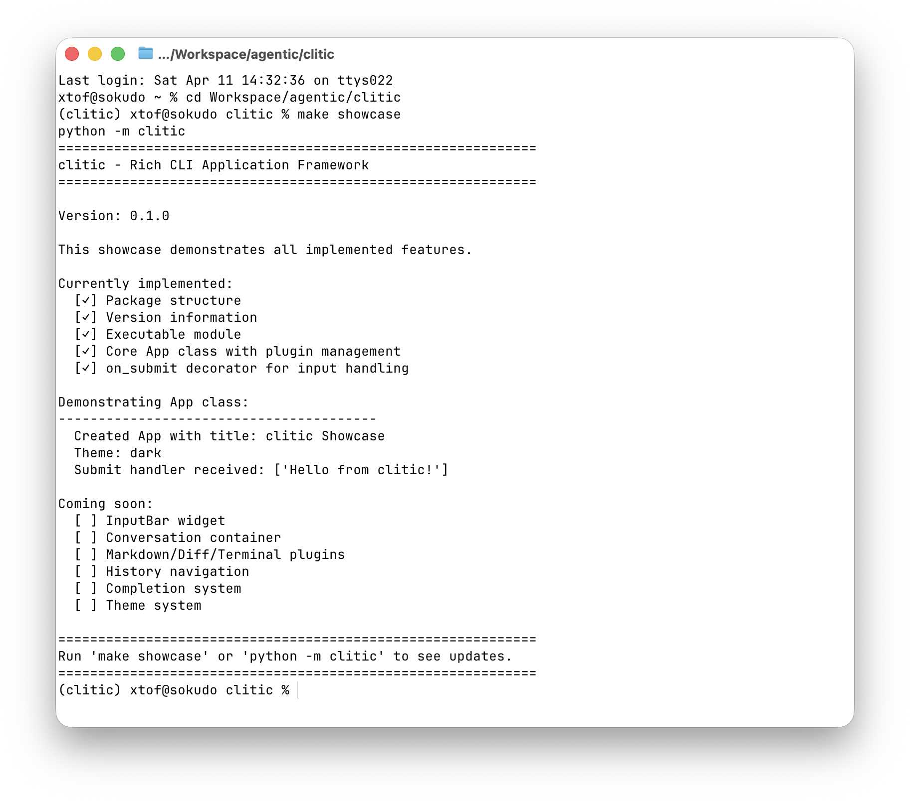

# clitic

A Python package for building rich, interactive CLI applications.

## Overview

clitic provides reusable components for building terminal user interfaces (TUIs) with:
- Multiline input with syntax highlighting and history
- Scrollable content areas with pluggable renderers
- Markdown, diff, and terminal content rendering
- CSS-like styling and theming
- Responsive layouts

Built on Textual for the TUI framework, with Rich for rendering.

## Installation

```bash
pip install clitic
```

## Quick Start

```python
from clitic import App, Conversation

conversation = Conversation()
app = App(title="My CLI Tool")

@app.on_submit
def handle_input(text: str):
    conversation.append("user", text)
    # Process input...

app.run()
```

## Features

- **InputBar**: Multiline input with history navigation, completion, and mode switching
- **Conversation**: Scrollable content container with expandable blocks
- **Tree/Table**: Collapsible tree and table widgets
- **Plugins**: Markdown, diff, and terminal content renderers
- **Theming**: Dark and light themes with customization
- **Responsive**: Layouts adapt to terminal width

## Development

### Requirements

- [pyenv](https://github.com/pyenv/pyenv) with pyenv-virtualenv plugin
- Python 3.11+

### Setup

```bash
# Create and activate virtual environment
make setup
pyenv activate clitic

# Or for automatic activation:
echo 'clitic' > .python-version

# Install dependencies
make install
```

### Development Commands

| Command | Description |
|---------|-------------|
| `make test` | Run tests with coverage |
| `make showcase` | Run feature showcase application |
| `make typecheck` | Run mypy type checking |
| `make lint` | Run ruff linting |
| `make format` | Format code with ruff |
| `make check` | Run all checks |

## Showcase



The package includes an executable showcase that demonstrates all implemented features:

```bash
python -m clitic
# or
make showcase
```

The showcase is updated as features are implemented, providing a live demonstration of the framework's capabilities.

### Building & Publishing

```bash
make build        # Build package
make publish      # Publish to PyPI
make publish-test # Publish to TestPyPI
```

### Cleanup

```bash
make clean      # Remove build artifacts
make clean-all  # Remove build artifacts and virtualenv
```

Run `make help` for all available targets.

## License

MIT License