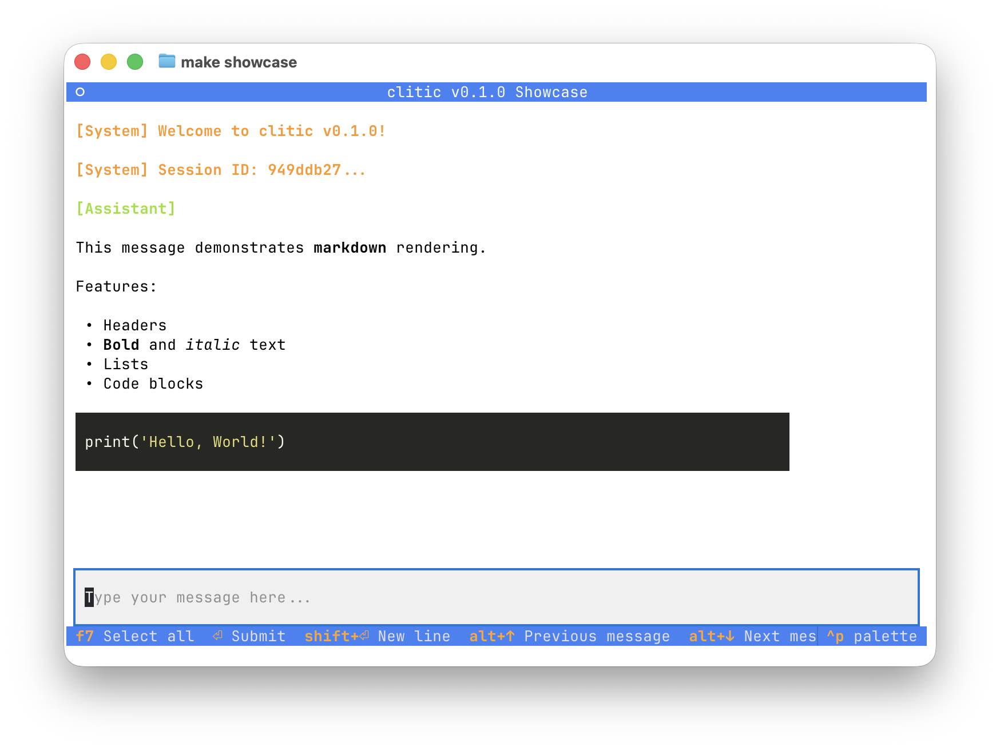

# clitic

[][pypi]
[][pypi]
[][uv]
[][ci]
[][coveralls]
[][license]
[](https://christophe.vg/about/Agentic-Workflow)

A Python package for building rich, interactive CLI applications.

## Why "clitic"?

The name is a playful linguistic reference. A **clitic** (/ˈklɪtɪk/) is an unstressed word that normally occurs only in combination with another word — like the 'm in "I'm".

The name fits perfectly because:

- It starts with **"CLI"** — Command Line Interface
- Like its linguistic namesake, **clitic** is designed to exist in combination with another project — yours! It's a framework meant to be the foundation for your rich interactive CLI applications.

## Overview

clitic provides reusable components for building terminal user interfaces (TUIs) with:
- Multiline input with syntax highlighting and history
- Scrollable content areas with pluggable renderers
- Markdown, diff, and terminal content rendering
- CSS-like styling and theming
- Responsive layouts

Built on Textual for the TUI framework, with Rich for rendering.

## Installation

```bash
pip install clitic
```

## Quick Start

Run the interactive showcase to see clitic in action:

```bash
python -m clitic
```

Or build your own TUI application:

```python
from textual.app import ComposeResult
from clitic import App, Conversation, InputBar

class MyApp(App):
    def compose(self) -> ComposeResult:
        yield Conversation(id="messages")
        yield InputBar(placeholder="Type your message...")

    def on_mount(self) -> None:
        conversation = self.query_one(Conversation)
        conversation.append("system", "Welcome!")

    def on_input_bar_submit(self, event: InputBar.Submit) -> None:
        conversation = self.query_one(Conversation)
        conversation.append("user", event.text)

MyApp().run()
```

See the [documentation](https://clitic.readthedocs.io/) for complete API reference.

## Features

- **InputBar**: Multiline input with auto-grow, cursor movement, selection, and submit-on-Enter
- **Conversation**: Scrollable content container with virtual rendering for 100,000+ lines
- **Plugin System**: Extensible content rendering with built-in Markdown support
- **Session persistence**: Resume conversations with block pruning for memory efficiency
- **Theming**: Dark and light themes with CSS-like styling

## Roadmap

- **Tree/Table**: Collapsible tree and table widgets
- **Additional Plugins**: Diff and terminal content renderers
- **Responsive layouts**: Adaptive layouts based on terminal width

## Development

### Requirements

- [pyenv](https://github.com/pyenv/pyenv) with pyenv-virtualenv plugin
- Python 3.11+

### Setup

```bash
# Create and activate virtual environment
make setup
pyenv activate clitic

# Or for automatic activation:
echo 'clitic' > .python-version

# Install dependencies
make install
```

### Development Commands

| Command | Description |
|---------|-------------|
| `make test` | Run tests with coverage |
| `make showcase` | Run feature showcase application |
| `make typecheck` | Run mypy type checking |
| `make lint` | Run ruff linting |
| `make format` | Format code with ruff |
| `make check` | Run all checks |

## Showcase



The package includes an executable showcase that demonstrates all implemented features:

```bash
python -m clitic
# or
make showcase
```

The showcase is updated as features are implemented, providing a live demonstration of the framework's capabilities.

### Building & Publishing

```bash
make build        # Build package
make publish      # Publish to PyPI
make publish-test # Publish to TestPyPI
```

### Cleanup

```bash
make clean      # Remove build artifacts
make clean-all  # Remove build artifacts and virtualenv
```

Run `make help` for all available targets.

## Changelog

See [CHANGELOG](docs/development/changelog.md) for version history.

## License

MIT License

[pypi]: https://pypi.org/project/clitic/
[uv]: https://docs.astral.sh/uv/
[ci]: https://github.com/christophevg/clitic/actions
[coveralls]: https://coveralls.io/github/christophevg/clitic
[license]: https://github.com/christophevg/clitic/blob/master/LICENSE